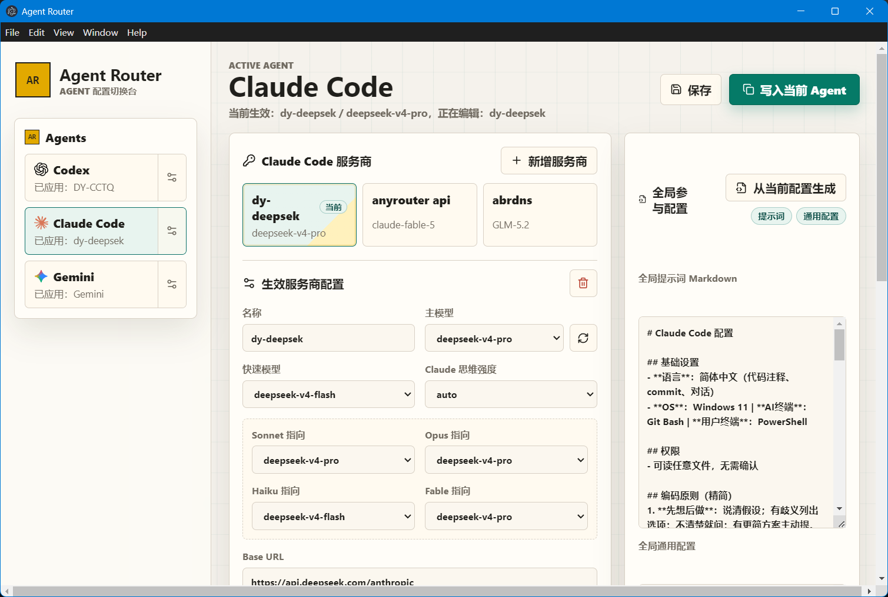

# agentRouter

Agent Router 是一个 Windows 桌面应用，用来在 OpenAI 兼容、Anthropic 兼容、Gemini 兼容以及自定义服务商配置之间切换本地 AI 编程 Agent 的配置。

项目基于 Electron、electron-vite、React 和 TypeScript 构建。



## 功能

- 分别管理 Codex、Claude Code 和 Gemini 的服务商配置。
- 为每个 Agent 保存多个服务商，并将当前选择的 Base URL、API Key、模型、思维强度和提示词写入本地配置。
- 模型可手动输入，也可从兼容服务商接口获取模型列表。
- 支持全局通用配置；可从当前本地配置导入非服务商部分，作为后续写入的基础。
- 应用 Codex 配置时保留非 Agent Router 管理的设置，并将默认模型和已保存的模型选项同步到 Codex 模型目录。
- 写入配置或提示词前自动创建带时间戳的备份，并按设置的保留数量清理旧备份。
- 读取并监听当前配置文件和提示词文件，外部修改会同步反映到界面。

## 环境要求

- Windows 11
- Node.js
- pnpm

## 开发

安装依赖：

```bash
pnpm install
```

以开发模式启动桌面应用：

```bash
pnpm dev
```

运行生产构建检查：

```bash
pnpm build
```

创建 Windows 安装包：

```bash
pnpm dist
```

## 项目结构

```text
src/main/       Electron 主进程和配置文件操作
src/preload/    暴露给渲染进程的安全桥接层
src/renderer/   React 界面
src/shared/     共享 TypeScript 类型
```

## 工作方式

服务商配置保存在 Electron user data 中。每个 Agent 可以保存多个服务商，但每次仅将当前选中的服务商应用到本地配置文件。

应用时会写入服务商配置、全局提示词和可选的全局通用配置。Codex 会将服务商配置写入 Agent Router 管理区，同时合并全局通用配置并保留其他现有设置；Claude Code 和 Gemini 使用其 JSON 模板。

应用 Codex 后，默认模型和该服务商保存的模型选项会补充到 `%USERPROFILE%/.codex/cc-switch-model-catalog.json`。已有模型条目不会被覆盖。

覆盖已有配置或提示词文件前，会先复制为 `*.bak-<timestamp>` 备份文件。备份保留数量可以在应用中配置。

可用模板变量：

```text
{{provider.name}}
{{provider.baseUrl}}
{{provider.apiKey}}
{{provider.defaultModel}}
{{provider.smallFastModel}}
{{provider.reasoningEffortConfig}}
{{provider.contextWindowConfig}}
{{globalPrompt}}
{{json.globalPrompt}}
{{globalTemplate}}
{{isoDate}}
```

其中 Claude Code 的默认模板还使用 `{{claudeSettingsJson}}`；通常不需要手动修改模板。

默认目标路径：

```text
%USERPROFILE%/.codex/config.toml
%USERPROFILE%/.codex/AGENTS.md
%USERPROFILE%/.claude/settings.json
%USERPROFILE%/.claude/CLAUDE.md
%USERPROFILE%/.gemini/settings.json
%USERPROFILE%/.gemini/GEMINI.md
%USERPROFILE%/.codex/cc-switch-model-catalog.json
```

## 安全说明

本应用会写入本地 Agent 配置文件，其中可能包含 API Key。不要把生成的配置文件、`.env` 文件、打包产物、缓存或 Electron user-data 状态提交到公开仓库。
